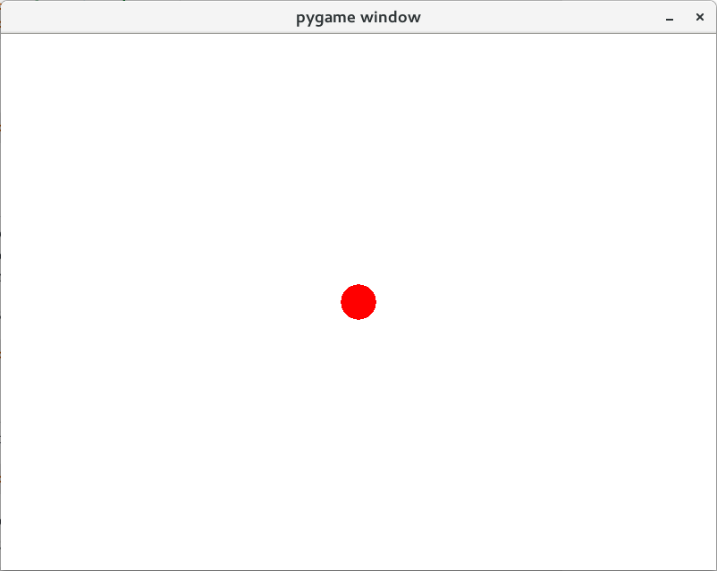
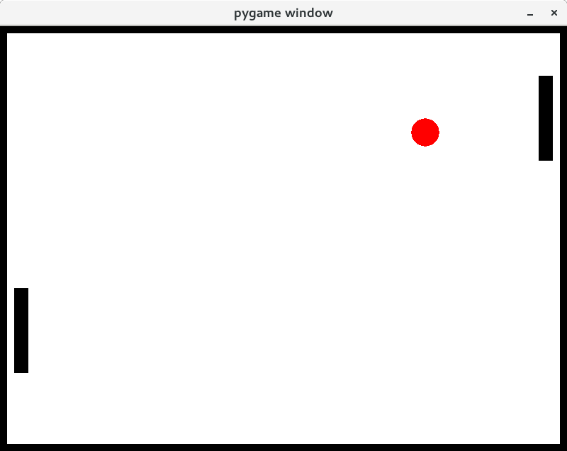

==============
Quick tutorial
==============

FGAme is a physics oriented game engine oriented to ease to use and useful in
an educational setting. Hence, don't expect blazing fast simulation and cutting
edge graphics. For simple 2D games, however, we can expect a lot of fun!

In the dynamic spirit of Python, we can use FGAme both as a script or in
interactive mode. Of course, the interactive shell is only useful for quick
experimentation so don't try to create complex games with it. You can also
use it for debugging, by initializing your game in the interactive mode so it
is possible to interact with any object created in game.

Pong
====

Let's create a functional Pong example with FGAme. Open an interactive shell
(such as IPython/Jupyter or Python builtin shell). If you have ipython installed,
execute it from the command line::

    $ ipython

Now let's start programming!

The first step is to import all symbols used by FGAme. We start the interactive
mode calling the start() function.

>>> from FGAme import *
>>> start()                                                      #doctest: +SKIP

You will see that a blank window will open: this is already our game running. We
can add objects in the screen using the ``world`` object and its ``add```
attribute.

>>> ball = world.add.circle(20, pos=pos.middle, color='red')

The command above creates a circle which is immediately shown on the screen. Notice
that we have defined a few parameters of this circle: the first argument is its
radius measured in pixels. ``pos`` is a vector that controls the position of the
center point and. We've used the pos.middle constant to choose the coordinates of
the middle of the screen. Finally, the color parameter controls the circle color
and can be either a name string, a tuple of RGB coordinates or even HTML hex
values (e.g.: ``'#FF0000'``).



Now lets make the ball move:

>>> ball.vel = (50, -10)

You will notice that it will start to move slightly downwards to the right.
Velocity is measured in pixels per second and we can control it by setting
either a vector value or controlling each coordinate.

>>> ball.vx = -50

As you read this, the ball may already had left the screen. Let us fence it by
creating a margin around the screen that objects cannot pass:

>>> world.add.margin(10)                                     #doctest: +ELLIPSIS
(...)

Notice the 10px margin that appeared on the screen.

Maybe it is necessary to put your ball back in sight, by placing it again in
the middle of the screen

>>> ball.pos = pos.middle

The next step is to create the paddles to interact with the ball. Let us call
them ``player1`` and ``player2``

>>> player1 = world.add.aabb(pos=(30, 300), shape=(20, 120))
>>> player2 = world.add.aabb(pos=(770, 300), shape=(20, 120))

The AABB stands for axis-aligned bounding box. It is a rectangle that aways
keeps its orientation aligned with the x and y axis. We created it by setting
the position of the center point and a ``shape`` tuple with its width and
height.

If you wait long enough, the ball will probably hit one of the paddles and you
will notice that it respond to collisions. This is fine, according to physics,
but of course, it is not the way it should work. The paddle is free to move in
all directions and we want to restrict movement to the **y** axis..

We can fix this by giving a very large mass to each player as heavier objects
are least affected by collisions. Mass is measured with the same scale as area,
which in our world is pixels squared. Hence our 20x120 square has a mass of
2400. We can make it much larger

>>> player1.mass = player2.mass = 10000

If you wait a few collisions, you will notice that now the paddles move much
less after each collision. But they still move. We could increase the mass to
very large values to make this movement negligible or, better yet, we can set
the mass to infinite, as an object with infinite mass is not affected at all by
finite forces

>>> player1.mass = player2.mass = 'inf'

Now that the mass is infinite, both objects pass through the walls! The reason
is that the margin is formed by objects with infinite mass. We cannot compute
collision forces in this case because these collisions create infinitely large
forces! Remember that acceleration is force divided by mass: now we have infinity
divided by infinity. Not good... FGAme simply ignores collisions of objects with
infinite mass since there is no sane way to resolve it.

Let us adjust the positions and velocities of both player objects and start
again

>>> player1.vel = player2.vel = (0, 0)
>>> player1.pos = (30, 300)
>>> player2.pos = (770, 300)

The next step is to add user interaction. The way it works in FGAme is by
creating functions that are executed when specific events occur. In our case,
we want a function that moves each player slightly up or down while the correct
keys are being pressed. This function already exists: it is the ``.move()``
method of all physical objects:

>>> # this will move player1 0px to the right and 50px up
>>> player1.move(0, 50)                                          #doctest: +SKIP

We can bind the move method to the event "key is being pressed" using the
``on(...).do(...)`` syntax. In FGAme nomenclature, the "long-press" event
triggered with a "w" key should execute ``player1.move(0, 4)``. Long press is
executed every frame that the key is pressed. There are similar events "key-up"
and "key-down"  that only execute in specific frames.

Let us bind the "long-press" event with the move function:

>>> on('long-press', 'w').do(player1.move, 0, 4)             #doctest: +ELLIPSIS
move(...)

We now adjust the same command for the other keys:

>>> on('long-press', 's').do(player1.move, 0, -4)            #doctest: +ELLIPSIS
move(...)
>>> on('long-press', 'up').do(player2.move, 0, 4)            #doctest: +ELLIPSIS
move(...)
>>> on('long-press', 'down').do(player2.move, 0, -4)         #doctest: +ELLIPSIS
move(...)

Now we have a functional Pong game! Let us give a nice hit to the red ball
and start playing.



>>> ball.pos = pos.middle; ball.vel = vel.random()

Have fun!
